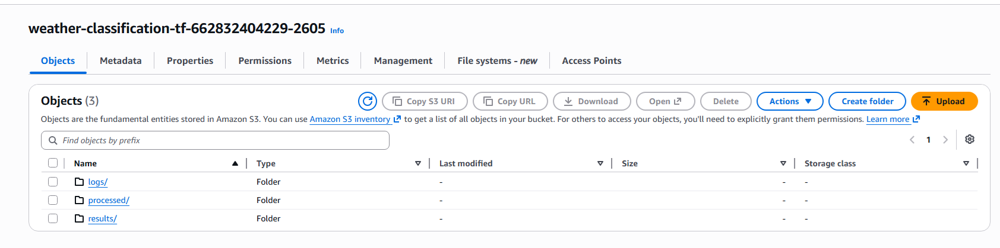
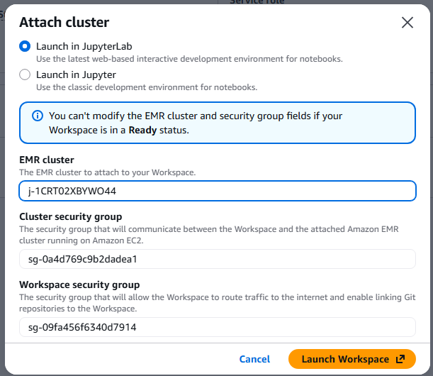
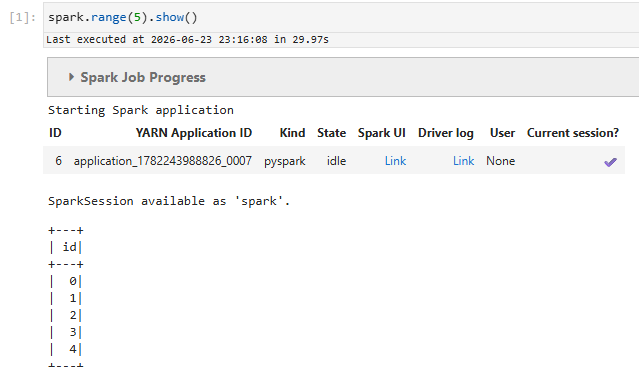
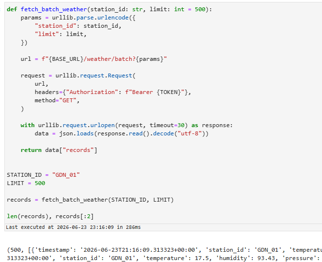
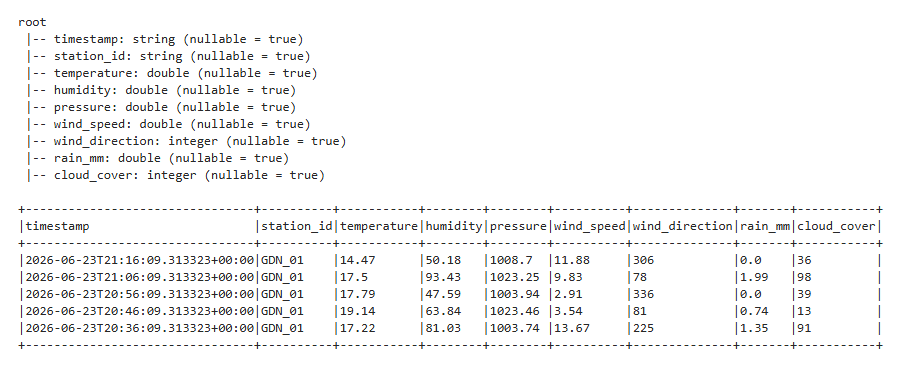
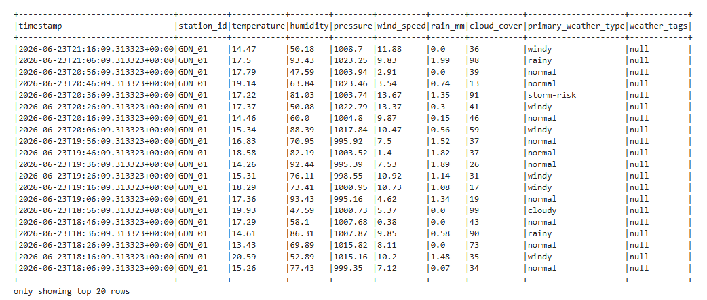
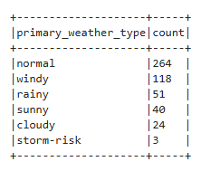
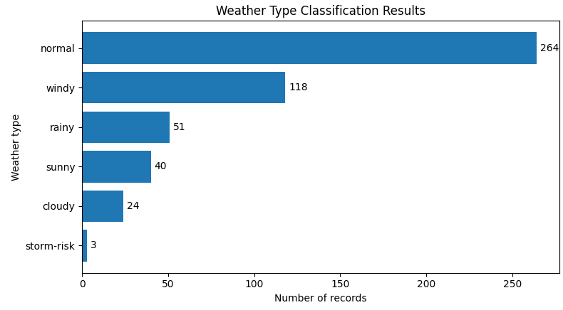

# Weather Type Classification on AWS EMR

This project implements a weather classification pipeline using a REST weather API, Amazon EMR, PySpark, Amazon S3, Terraform, and Python visualization notebooks.

The goal is to convert raw weather measurements into readable weather categories such as `normal`, `windy`, `rainy`, `sunny`, `cloudy`, and `storm-risk`.

---

## 1. How to Run the Project

### 1.1 Required configuration

The PySpark notebook requires two API values:

```python
BASE_URL = ""
TOKEN = ""
```

Before running the notebook, replace them locally with the weather API base URL and token:

```python
BASE_URL = "https://YOUR_API_URL_HERE"
TOKEN = "YOUR_TOKEN_HERE"
```

The selected weather station and number of records are configured as:

```python
STATION_ID = "GDN_01"
LIMIT = 500
```

Do **not** commit a real API token to GitHub.

Before committing or pushing the notebook, remove the real values and leave placeholders:

```python
BASE_URL = ""
TOKEN = ""
```

This prevents exposing the API token in the repository.


---

### 1.2 Local test

From the project root:

```powershell
python -m venv .venv
.\.venv\Scripts\Activate.ps1

pip install -r requirements.txt
$env:PYTHONPATH="."

python .\scripts\test_local_classification.py
python .\scripts\run_local_pipeline.py
```

The local pipeline fetches weather data, applies classification rules, and saves local sample outputs.

---

### 1.3 AWS / EMR run

Start the AWS lab, then open AWS CloudShell.

Go to the Terraform folder:

```bash
cd ~/weather-type-classification-aws/terraform
terraform init
terraform plan
terraform apply
```

After Terraform creates the EMR cluster, open:

```text
Amazon EMR → EMR Studio → Workspaces
```

Attach the workspace to the running EMR cluster and launch JupyterLab.

Then run the PySpark notebook:

```text
notebooks/weather_classification_emr.ipynb
```

This notebook:

1. fetches weather data from the API,
2. creates a Spark DataFrame,
3. classifies each record,
4. saves the classified dataset to S3,
5. saves weather type counts to S3.

After that, run:

```text
notebooks/weather_visualization.ipynb
```

This notebook reads the saved S3 results and creates charts.

---

### 1.4 Clean up AWS resources

At the end of the session, destroy AWS resources:

```bash
cd ~/weather-type-classification-aws/terraform
terraform destroy
```

If the S3 bucket is not empty:

```bash
aws s3 rm s3://weather-classification-tf-662832404229-2605 --recursive
terraform destroy
```

---

## 2. Project Structure

```text
weather-type-classification-aws/
│
├── data/                 # Local sample data generated by scripts
├── docs/                 # Documentation files
├── images/               # Screenshots and charts used in README/report
├── notebooks/            # Jupyter notebooks for EMR and visualization
├── results/              # Local generated results
├── scripts/              # Local test and pipeline scripts
├── src/                  # Python source code
├── terraform/            # Terraform infrastructure for AWS EMR/S3
│
├── .gitignore
├── README.md
└── requirements.txt
```

Main folders:

- `src/` contains reusable Python code for API access and classification.
- `scripts/` contains local test scripts.
- `notebooks/` contains the EMR PySpark notebook and Python visualization notebook.
- `terraform/` creates AWS resources.
- `images/` contains screenshots used in the report.
- `results/` and `data/` are local generated outputs and should usually not be committed.

---

## 3. Architecture

```text
Weather REST API
        ↓
PySpark notebook on Amazon EMR
        ↓
Rule-based weather classification
        ↓
Amazon S3
    ├── processed classified dataset
    └── weather type counts
        ↓
Python visualization notebook
        ↓
Final charts
```

The project separates cloud processing from visualization. The main data processing is performed with PySpark on EMR, while charts are created in a separate Python notebook from S3 outputs.

---

## 4. AWS Infrastructure

Terraform was used to create the project infrastructure:

- S3 bucket for logs and outputs,
- EMR cluster for PySpark processing,
- S3 public access block.

Project bucket used during the run:

```text
weather-classification-tf-662832404229-2605
```

The S3 bucket contains:

```text
logs/
processed/
results/
```



---

## 5. EMR Studio and Spark Test

The EMR Studio workspace was attached to the EMR cluster.



Spark was tested with:

```python
spark.range(5).show()
```



This confirmed that the PySpark notebook was connected to the EMR cluster.

---

## 6. Data Collection

Weather data was fetched from the REST API for station:

```python
STATION_ID = "GDN_01"
LIMIT = 500
```

The batch endpoint returned weather records containing timestamp, station ID, temperature, humidity, pressure, wind speed, wind direction, rain amount, and cloud cover.



---

## 7. Spark DataFrame

The API records were converted into a Spark DataFrame.

An explicit schema was used because some numeric values, especially `rain_mm`, could appear as both integer-like and floating-point values.



Main fields:

```text
timestamp
station_id
temperature
humidity
pressure
wind_speed
wind_direction
rain_mm
cloud_cover
```

---

## 8. Weather Classification Logic

The classification is rule-based. Each weather record receives a `primary_weather_type`.

Example rules:

```text
storm-risk:
wind_speed > 12 and cloud_cover > 75 and pressure < 1005

rainy:
rain_mm > 0.5 and cloud_cover > 70

windy:
wind_speed > 10

cloudy:
cloud_cover > 80 and rain_mm == 0

sunny:
cloud_cover < 30 and rain_mm == 0

normal:
none of the above
```

The order matters because one record can match multiple conditions. For example, a record can be both rainy and windy. In that case, the first matching higher-priority class becomes the `primary_weather_type`.

Priority order:

```text
storm-risk → rainy → windy → cloudy → sunny → normal
```

Example PySpark logic:

```python
classified_df = (
    raw_df
    .withColumn(
        "primary_weather_type",
        F.when(
            (F.col("wind_speed") > 12)
            & (F.col("cloud_cover") > 75)
            & (F.col("pressure") < 1005),
            "storm-risk",
        )
        .when(
            (F.col("rain_mm") > 0.5)
            & (F.col("cloud_cover") > 70),
            "rainy",
        )
        .when(F.col("wind_speed") > 10, "windy")
        .when(
            (F.col("cloud_cover") > 80)
            & (F.col("rain_mm") == 0),
            "cloudy",
        )
        .when(
            (F.col("cloud_cover") < 30)
            & (F.col("rain_mm") == 0),
            "sunny",
        )
        .otherwise("normal")
    )
)
```

---

## 9. Classified Dataset

The final classified dataset keeps the original weather measurements and adds a weather class.

Main added column:

```text
primary_weather_type
```

Example output:



---

## 10. Aggregated Results

The classified records were grouped by weather type:

```python
counts_df = (
    classified_df
    .groupBy("primary_weather_type")
    .count()
    .orderBy(F.desc("count"))
)
```

Result:

```text
normal       264
windy        118
rainy         51
sunny         40
cloudy        24
storm-risk     3
```



---

## 11. Saving Outputs to S3

The classified dataset was saved as Parquet:

```text
s3://weather-classification-tf-662832404229-2605/processed/weather_classified/station_id=GDN_01/
```

The weather type counts were saved as CSV:

```text
s3://weather-classification-tf-662832404229-2605/results/weather_type_counts/station_id=GDN_01/
```

Code used:

```python
classified_df.write.mode("overwrite").parquet(classified_output_path)
counts_df.write.mode("overwrite").csv(counts_output_path, header=True)
```

---

## 12. Visualization

The visualization notebook reads the already processed results from S3. It does not call the API again.

Because Spark saves CSV output as multiple `part-*.csv` files, the notebook loads all parts and combines them:

```python
frames = []

for key in csv_keys:
    obj = s3.get_object(Bucket=PROJECT_BUCKET, Key=key)
    part_df = pd.read_csv(io.BytesIO(obj["Body"].read()))
    frames.append(part_df)

counts = pd.concat(frames, ignore_index=True)
```

The final chart shows the distribution of classified weather types:



---

## 13. Results

The most common class was `normal`, followed by `windy`.

Final weather type distribution:

```text
normal       264
windy        118
rainy         51
sunny         40
cloudy        24
storm-risk     3
```

The result shows that the pipeline successfully:

1. fetched weather data from the API,
2. processed it on Amazon EMR using PySpark,
3. classified weather records,
4. saved outputs to Amazon S3,
5. created a final visualization from saved results.

---

## 14. Problems and Solutions

### GitHub clone was slow in EMR Studio

The repository was zipped locally and uploaded manually to JupyterLab.

### PySpark notebook could not import local modules

The PySpark kernel was executed through Livy in a different filesystem location, so the EMR notebook was made self-contained.

### Spark schema inference failed

Spark could not merge integer and double values in `rain_mm`. This was solved by defining an explicit schema and normalizing numeric values.

### Matplotlib was not available in the PySpark/Livy environment

Visualization was moved to a separate Python notebook, which read the saved S3 results and generated the chart.

---

## 15. Summary

This project demonstrates a complete AWS-based weather classification pipeline.

Technologies used:

- AWS EMR,
- PySpark,
- EMR Studio,
- Amazon S3,
- Terraform,
- Python,
- Matplotlib.

Final workflow:

```text
Terraform infrastructure
        ↓
EMR PySpark processing
        ↓
S3 output storage
        ↓
Python visualization
```

The project is intentionally small, but the architecture can scale to larger weather datasets.

---

## 16. Future Improvements

Possible improvements:

- process more stations,
- increase the data size,
- improve classification thresholds,
- store API token in AWS Secrets Manager or Parameter Store,
- add GitHub Actions with GitHub Secrets,
- compare rule-based classification with machine learning,
- create a dashboard instead of static charts,
- use a smaller or single-node EMR cluster for cost optimization.
